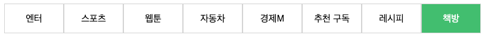

# Flexbox
## P1

[p1.html](p1.html)과 [p1.css](p1.css)를 사용합니다.
- HTML 요소를 추가하지 않고,
- 각 글자는 각 `
` 요소의 정중앙에 위치해야 하며,
- HTML 요소의 클래스를 수정하지 않고,
  
주어진 그림과 동일하게 보이도록 CSS를 수정하세요.

## P2

[p2.html](p2.html)과 [p2.css](p2.css)를 사용합니다.
- HTML 요소를 추가하지 않고,
- HTML 요소에 정의된 id나 class를 수정하지 않고,
- CSS 선택자를 추가하지 않고

주어진 그림과 동일하게 보이도록 CSS를 수정하세요.

## P3

[p3.html](p3.html)과 [p3.css](p3.css)를 사용합니다.
주어진 HTML이 다음 그림처럼 브라우저에 나오도록 CSS만 수정하세요.
간격이 완전히 일치할 필요는 없으며, 이미지는 주어진 이미지를 활용합니다.

## P4

주어진 그림의 UI는 브라우저 최상단에 고정되는 Navigation Bar 입니다.
HTML과 CSS를 사용해 자유롭게 UI를 만들어 보세요.

