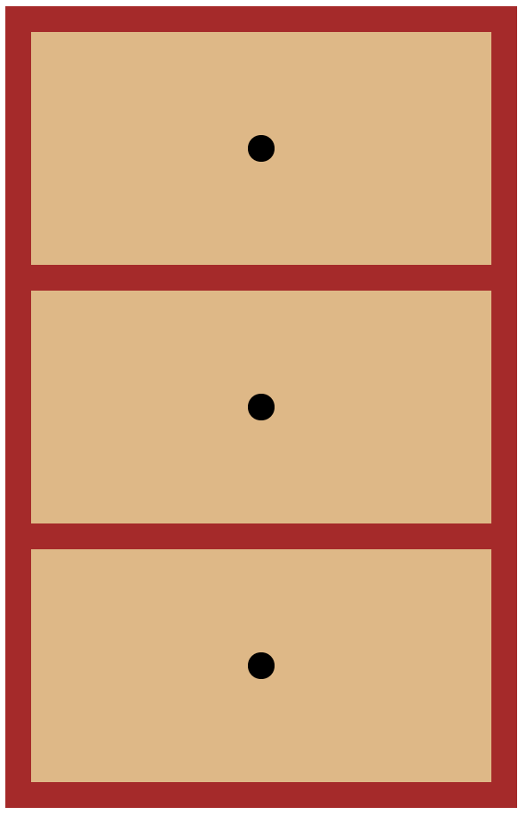
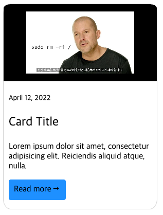
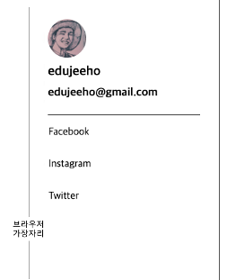
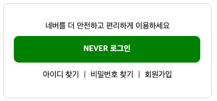

# CSS Box Model
## P1

[p1.html](p1.html)과 [p1.css](p1.css)를 사용합니다.
주어진 HTML이 다음 그림처럼 브라우저에 나오도록 CSS만 수정하세요.

## P2

[p2.html](p2.html)과 [p2.css](p2.css)를 사용합니다.
주어진 HTML이 다음 그림처럼 브라우저에 나오도록 CSS만 수정하세요.
간격이 완전히 일치할 필요는 없습니다.

## P3

[p3.html](p3.html)과 [p3.css](p3.css)를 사용합니다.
주어진 HTML이 다음 그림처럼 브라우저에 나오도록 CSS만 수정하세요.
간격이 완전히 일치할 필요는 없으며, 이미지는 주어진 이미지를 활용합니다.

## P4

다음 그림과 유사한 UI를 만들어 보세요. 간격과 크기는 완전히 일치할 필요는 없습니다.

